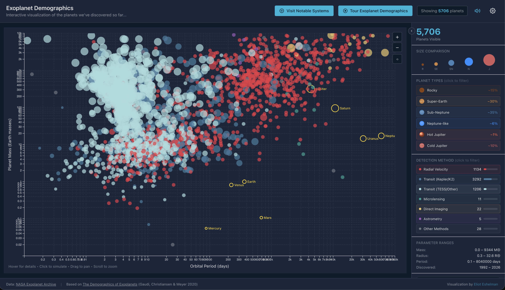
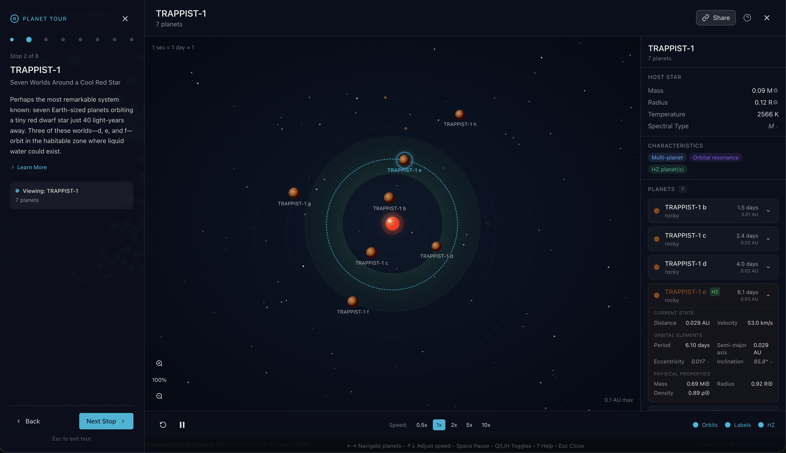

# Learn about Exoplanets!

**[Try it live: exoplanets.6by9.net](https://exoplanets.6by9.net/)**

Exoplanets are the planets in other solar systems (orbiting distant stars).

This interactive web visualization explores exoplanet demographics, inspired by
*The Demographics of Exoplanets* (Gaudi, Christiansen & Meyer 2020). The app
starts with a map of all the exoplanets we've found so far - showing both how
big they are, and how quickly (or slowly) they orbit their star. It also shows
you simulations of what those solar systems look like. There is also a tour taking
you throught some of the most interesting ones we've found so far!

## Screenshots





## Data sources

Most of the information shown is from actual measurements made by scientists. Some
information has been estimated (to allow you to see something), and the estimates
are marked.

- NASA Exoplanet Archive: https://exoplanetarchive.ipac.caltech.edu/
- "The Demographics of Exoplanets" (arXiv preprint): https://arxiv.org/abs/2011.04703


## Local development

Prerequisites:
- Node.js + npm

Run locally:
```bash
npm install
npm run dev
```

Open the URL printed by Vite (typically `http://localhost:5173`).

Build and preview:
```bash
npm run build
npm run preview
```

Lint and tests:
```bash
npm run lint
npm run test
```


## Data pipeline (optional)

If you want to refresh the dataset from the NASA archive, follow
`data-pipeline/README.md` for the full workflow.

